<div align="center">


<h1>芽绘台 / SproutCanvas</h1>

<p>自托管的多 Provider 图像创作工作台<br />
从一句提示词, 到单幅画作与连贯分镜.</p>

<p>
  <a href="https://nodejs.org/"></a>
  <a href="https://react.dev/"></a>
  <a href="https://www.typescriptlang.org/"></a>
  <a href="https://vite.dev/"></a>
  <a href="https://tailwindcss.com/"></a>
  <a href="https://docs.docker.com/compose/"></a>
</p>

<p>
  <a href="#在线体验">在线体验</a> |
  <a href="#页面预览">页面预览</a> |
  <a href="#后台管理">后台管理</a> |
  <a href="#功能一览">功能一览</a> |
  <a href="#快速开始">快速开始</a><br />
  <a href="#开发与验证">开发与验证</a> |
  <a href="#项目文档">项目文档</a>
</p>

</div>

## 在线体验

体验地址: **[draw.sleepypie.top](https://draw.sleepypie.top)**.

无需注册账号, 复制下面的公共测试访问码, 在登录页粘贴后进入工作台:

```text
sc_J3L9sv4YYnhv5lRbzgzA7PK4gwUbzZoc
```

此访问码供体验者共用, 额度状态以页面显示为准. 每个浏览器的任务与作品独立, 需要保留的作品请下载. 测试访问码仅用于工作台, 后台使用独立管理员密码.

## 页面预览

以下为当前版本的实际界面, 点击图片可查看原尺寸. 作品和参考图使用仓库演示素材, 分镜为待确认草稿, 灵感点与后台统计为隔离演示数据.

### 单图创作

在同一页完成提示词润色, 模板预览和多图参考. 最多添加 4 张参考图, 可逐张更换或移除. 创作画卷展示最近 4 个记录, 完整作品保存在展馆.

[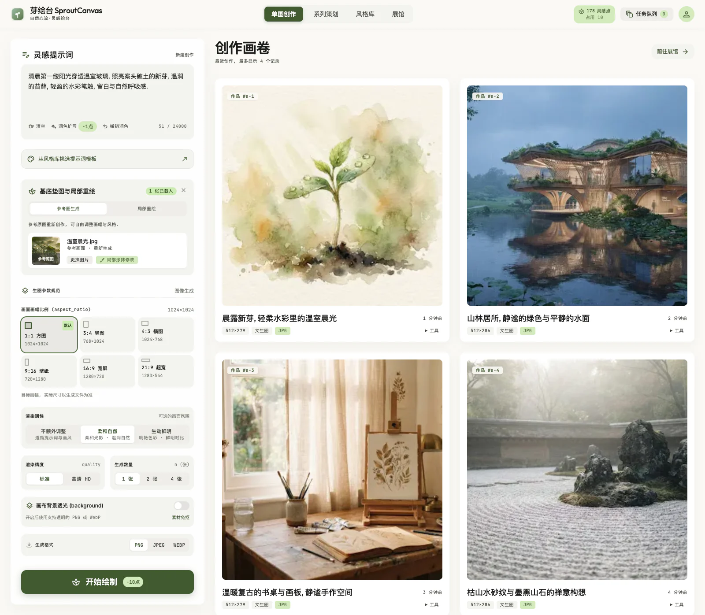](docs/images/studio.webp)

### 工作台登录

使用访问码进入工作台, 无需用户名或注册. 登录页与工作台共用字体, 纸面配色和深浅色主题.

[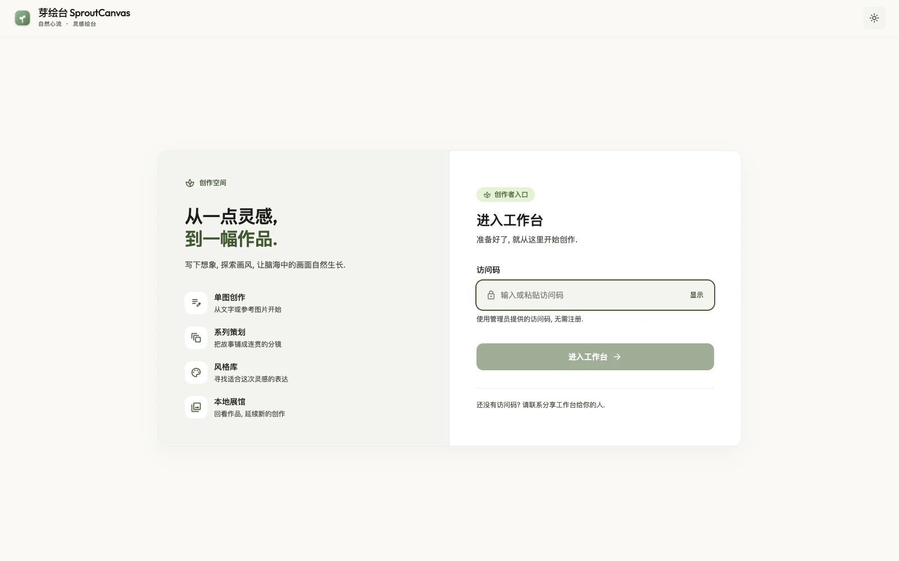](docs/images/workspace-login.webp)

### 系列策划

先将故事梗概或分镜剧本拆解为可编辑的提示词, 检查后再确认生图. 后续分镜通过首镜参考保持画面关联.

[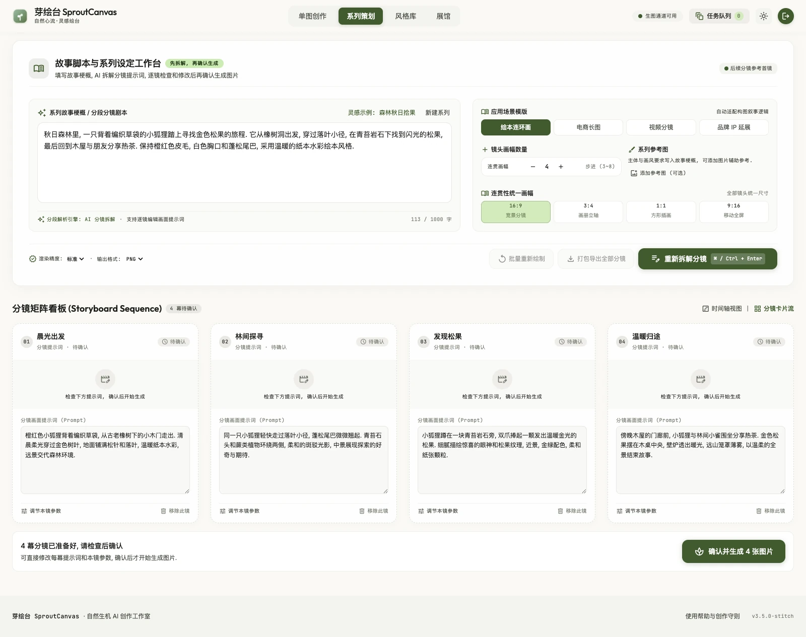](docs/images/series.webp)

### 风格库

按分类或关键词寻找模板, 复制原文提示词, 或直接发送到单图创作. 内容由管理后台维护.

[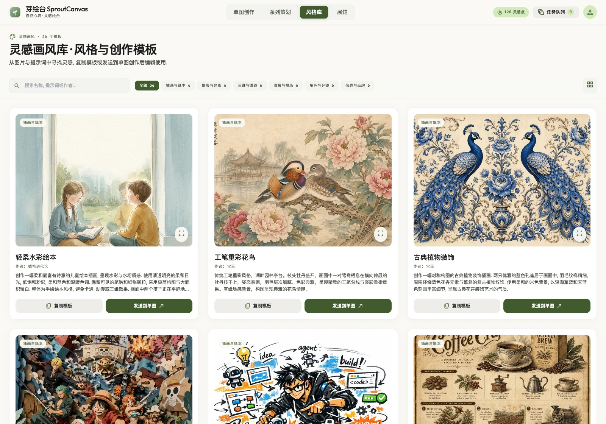](docs/images/styles.webp)

### 本地展馆

集中查看当前浏览器保存的单图和系列作品, 支持搜索, 筛选, 批量下载与删除.

[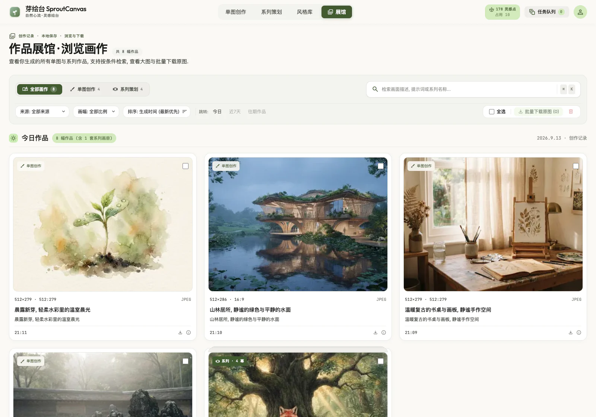](docs/images/gallery.webp)

### 作品详情

放大检视原图, 查看生成配方和系列版本, 下载图片或进入蒙版编辑. 缩放图片时, 工具按钮保持固定大小.

[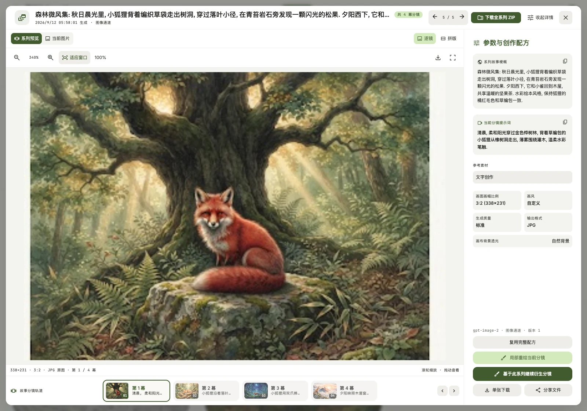](docs/images/viewer.webp)

## 后台管理

管理后台提供仪表盘, 风格管理和访问码管理三个入口, 使用独立管理员会话. 普通访问码不会获得管理权限.

### 管理员登录

[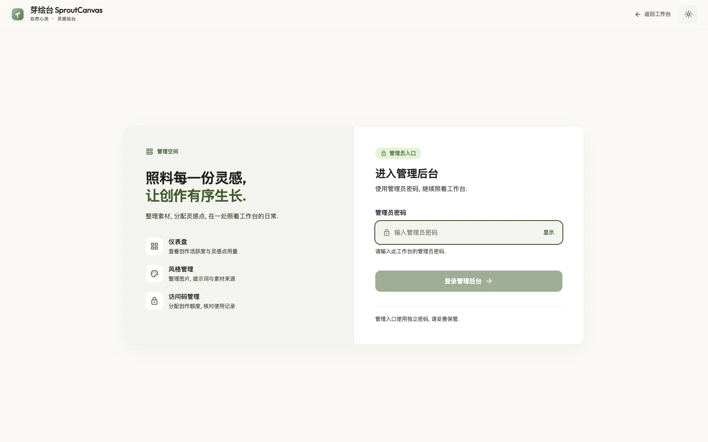](docs/images/admin-login.webp)

### 仪表盘

查看风格数量, 访问码状态和待核实任务. 创作次数与灵感点用量分别支持今日 / 本月 / 累计切换, 热力图展示最近 365 天的成功结算记录.

[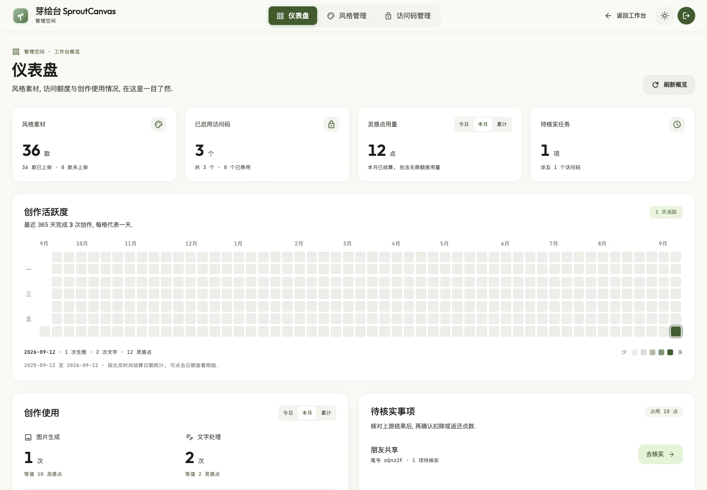](docs/images/admin-dashboard.webp)

### 风格管理

电脑端以四列卡片展示素材, 点击整张卡片即可编辑. 支持搜索, 上下架, 删除, 以及包含示例图的备份导入导出.

[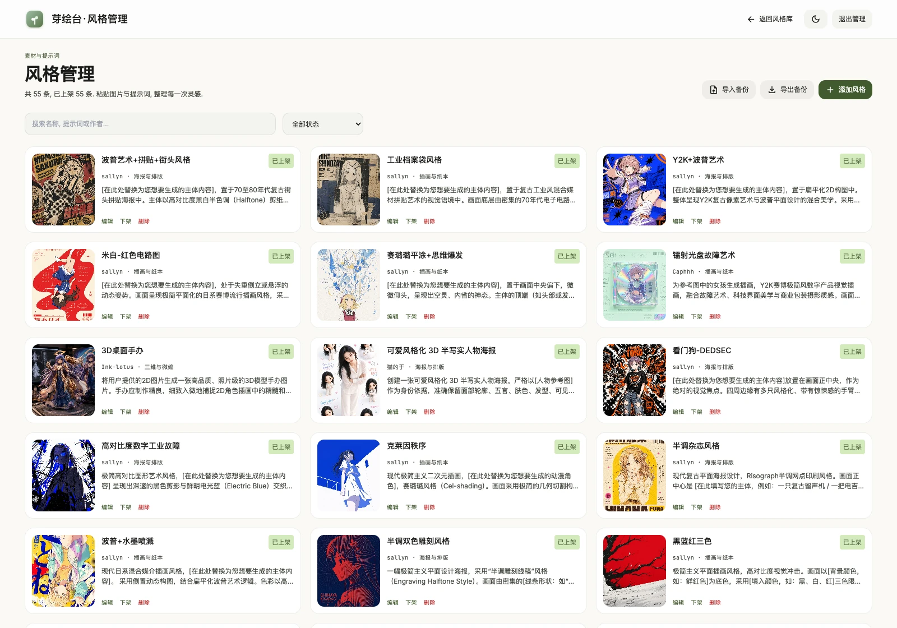](docs/images/style-admin.webp)

### 风格编辑

图片和完整提示词为必填项, 支持上传, 拖拽或直接粘贴图片. 名称, 分类, 作者, 来源和排序可选, 表单中直接展示全部字段, 保留提示词原文.

[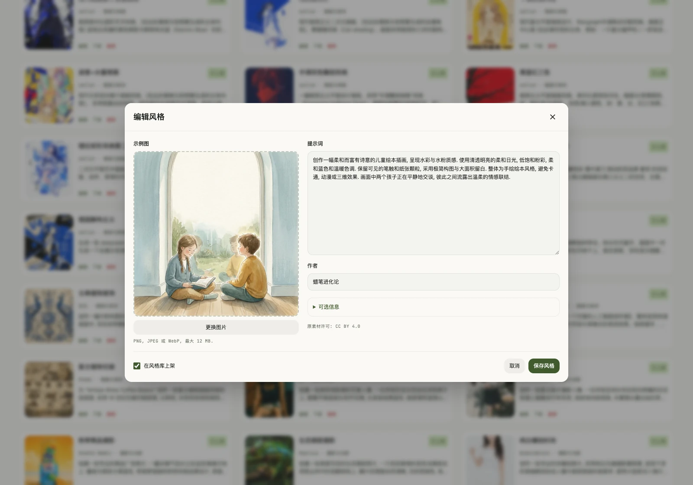](docs/images/style-editor.webp)

### 访问码与灵感点

创建一个或多个访问码, 分配有限或无限额度, 分别设置图片与文字处理的点值. 同一码可多人使用, 共用余额, 各浏览器的任务独立.

[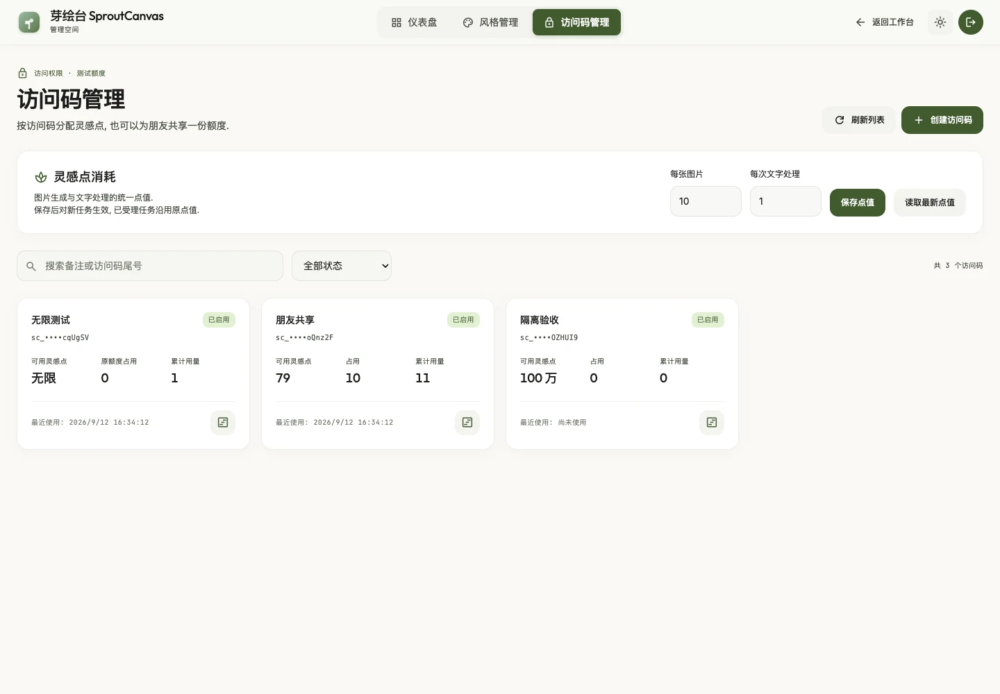](docs/images/access-admin.webp)

### 访问码设置

点击卡片打开设置弹窗, 修改用户可见名称, 调整灵感点或切换无限额度, 也可停用, 重置或删除访问码.

[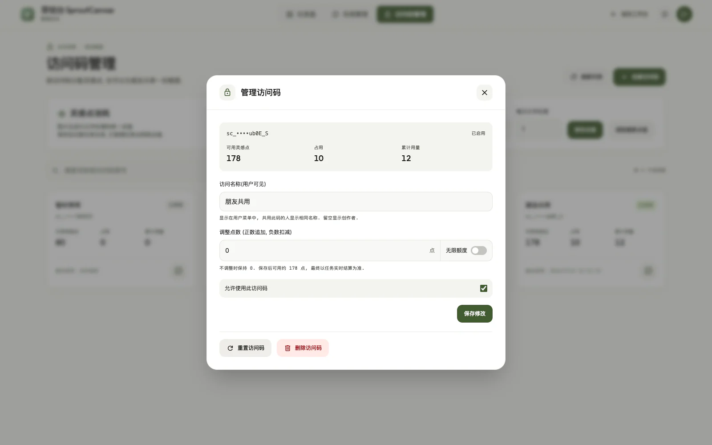](docs/images/access-settings.webp)

### 用量明细

从卡片上的用量图标打开独立明细, 查看预占, 成功扣除和返还记录. 对结果未知的任务保留预占, 由管理员核对上游结果后结算或返还.

[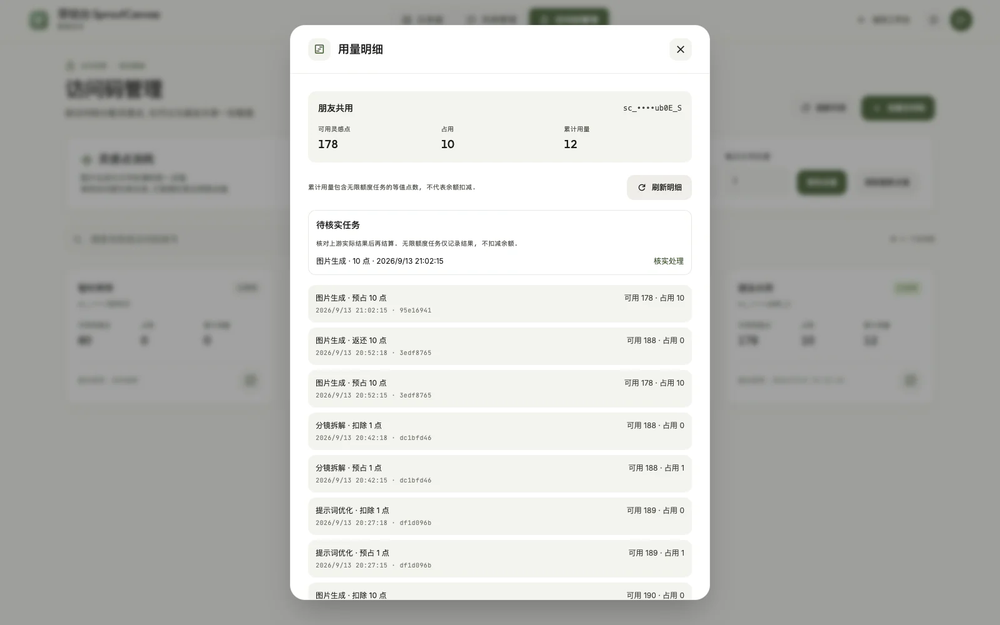](docs/images/access-usage.webp)

## 功能一览

- **单图创作**: 文生图, 最多 4 张图片共同参考和提示词润色. 润色支持撤销/恢复并保留手工修改, 参考图可多选上传, 拖拽或粘贴追加, 并逐张管理. 一次提交 1 / 2 / 4 张, 按输出张数使用灵感点, 顺序生成并逐张保存.
- **蒙版编辑**: 切换到局部重绘时使用第一张参考图, 点击绘制蒙版后涂抹需要修改的区域, 继承原图配方和画幅. 其余参考图保留, 切回参考图生成后可继续使用.
- **系列策划**: 根据创作需求或完整剧本智能规划 3-8 幕, 不限定应用场景. 支持最多 4 张参考图, 多选上传, 拖拽或粘贴追加, 并逐张管理. 先拆解提示词, 检查后确认生成, 后续分镜结合首镜保持连贯; 支持单镜编辑, 重绘, 版本查看和部分失败续交.
- **风格库**: 首次启动导入 36 款 / 6 类开源案例, 后续由后台维护, 更新与重启不会覆盖编辑结果. 支持搜索, 分类和原文复制, 发送到单图创作后展示模板示例图与名称, 可修改提示词后生成.
- **独立后台**: 集中维护风格素材, 访问码和灵感点, 通过仪表盘查看活跃度与用量, 在明细中核实异常任务. 详见 [后台管理](#后台管理).
- **本地展馆**: 检索单图与系列作品, 放大检视, 复用配方, 下载原图或 ZIP, 使用浏览器支持的系统文件分享.
- **切图拆分**: 按行列切分图片, 一次将全部切片打包为 ZIP, 也可单张下载或作为参考图继续创作. 在浏览器处理, 不消耗灵感点.
- **任务与界面**: 创作画卷展示最近 4 个记录, 全部作品在展馆查看. 提供全局任务队列, 等待任务取消和失败任务手动处理; 用户菜单收纳访问名称, 浅色 / 深色主题, 使用帮助与退出, 支持移动端布局.

## 快速开始

推荐使用 Docker Compose 部署, 并准备可用的图像与文本 API 通道.

1. 获取代码并创建本地配置.

   ```sh
   git clone https://github.com/rianlu/sprout-canvas.git
   cd sprout-canvas
   cp config/local.config.example.json config/local.config.json
   ```

2. 编辑 `config/local.config.json`, 按 [配置要求](docs/DEPLOY.md#1-配置要求) 填写图像通道, 文本通道和独立管理员密码.

3. 构建并启动服务.

   ```sh
   docker compose up -d --build
   ```

4. 先进入管理后台, 使用管理员密码登录, 在访问码管理中创建访问码并配置初始灵感点. 复制给使用者登录工作台, 无需注册账号.

启动后访问:

| 入口 | 地址 | 登录方式 |
| --- | --- | --- |
| 工作台 | [打开工作台](http://127.0.0.1:8888) | 管理员创建的访问码 |
| 管理后台 | [打开管理后台](http://127.0.0.1:8888/#admin) | 独立管理员密码 |

Docker 默认使用主机端口 `8888`. 持久化目录, 密码规则, HTTPS 与更新步骤见 [部署与配置](docs/DEPLOY.md#32-docker).

没有域名时, 可启用 [临时公网入口](docs/DEPLOY.md#321-临时公网入口), 让 Cloudflare Tunnel 随 Docker 项目一起启动和停止.

已有域名时, 按 [正式公网入口](docs/DEPLOY.md#322-正式公网入口) 配置固定网址, 继续复用现有 Docker 部署.

<details>
<summary>使用 Node.js 在本机运行</summary>

安装 Node.js 22.13 或更新版本, 推荐 Node.js 22 LTS 最新补丁版本. 按上方步骤获取代码并填写配置后, 在项目目录运行:

```sh
npm ci
npm start
```

默认打开 [http://127.0.0.1:8787](http://127.0.0.1:8787).

已有 Docker 实例时, 本机手动测试改用 `npm run start:local`, 默认地址为 [http://127.0.0.1:8789](http://127.0.0.1:8789), 数据与管理员凭据单独保存. 具体规则见 [本地启动](docs/DEPLOY.md#2-本地启动).

</details>

## 使用说明

- **作品与草稿**: 生成作品, 参考图, 蒙版和草稿保存在当前浏览器, 并按网站地址隔离, 不会在不同设备或域名之间同步. 服务端仅短期中转生成结果, 需要长期保留的作品请下载.
- **风格数据**: 管理员维护的风格文本与示例图持久保存到服务端, 更新部署后保留编辑结果. 使用后台备份功能导出完整风格库.
- **灵感点**: 默认图片 10 点, 文字处理 1 点, 管理员可修改. 有限额度在提交时预占, 成功后扣除, 明确失败或执行前取消返还. 结果未知时保留预占供核实; 刷新或关闭浏览器不会重复提交或自动退点. 无限额度仅记录用量, 不扣减余额. 余额为零仍可登录, 浏览风格和下载已有作品.
- **模型能力**: 支持 Images / Responses 图像接口和独立文本通道. 页面参数随通道能力调整, 请求尺寸作为目标画幅, 下载与查看器使用文件实际返回的格式和尺寸. 视频分镜只生成静态图片. 具体通道表现见 [真实通道能力验证](docs/REAL_API_VALIDATION.md).

## 技术栈

- **前端**: React 19, TypeScript 6, Vite 8, Tailwind CSS 3, 本地图标与字体.
- **服务端**: Node.js 22, 同源 HTTP 服务, Images / Responses 适配, 单 worker 任务队列.
- **数据**: 服务端使用内置 SQLite 保存任务元信息, 访问码, 点数账本, 会话和风格目录; 浏览器使用 IndexedDB 保存作品与草稿.
- **部署**: Docker Compose, Node.js 直接运行或单实例 PM2; 可选 Cloudflare Tunnel 提供临时或固定域名的 HTTPS 入口.

API Key 只由服务端持有. 保持单个 Node 进程, 单个容器副本和 `imageConcurrency: 1`. 模块职责与数据流见 [功能清单与架构评估](docs/FEATURE_ARCHITECTURE_REVIEW.md).

## 开发与验证

### 本地开发

安装 Node.js 22.13 或更新版本, 按 [快速开始](#快速开始) 完成代码获取和本地配置, 然后安装依赖:

```sh
npm ci
```

在两个终端分别启动 API 和前端:

```sh
# 终端 1: API 服务
npm run dev:api
```

```sh
# 终端 2: Vite 开发服务
npm run dev
```

使用 Vite 输出的地址访问页面, API 请求由 Vite 代理到本机服务.

### 验证命令

| 命令 | 验证范围 |
| --- | --- |
| `npm test` | 配置, 生成契约, 路由, HTTP, 访问码/点数事务, 结果领取和重启恢复, 同时完成前端构建. |
| `npm run test:browser` | 在隔离浏览器和虚拟上游中验证页面交互. |
| `npm run test:docker` | 容器页面, 产物一致性, 风格/账本持久化与备份恢复, 文件权限和健康检查. |
| `npm audit` | 检查包括构建工具在内的依赖. |

- 浏览器验收: 有系统 Chrome 时直接使用, 否则先运行 `npx playwright install chromium`.
- Docker 验收: 先运行 `docker build -t sprout-canvas:verify .` 构建验收镜像, 再执行测试命令.

上述自动测试使用隔离配置, 不调用真实生图通道. 先在本机完成验证, GitHub [Verify 工作流](.github/workflows/verify.yml) 负责复核.

## 项目文档

| 文档 | 阅读内容 |
| --- | --- |
| [部署与配置](docs/DEPLOY.md) | 配置字段, 运行方式, 更新与备份. |
| [产品需求](docs/PRD.md) | 功能定位, 使用流程与验收要求. |
| [设计规范](docs/DESIGN.md) / [品牌与定位](docs/BRAND_AND_POSITIONING.md) | 界面布局, 字体配色与产品文案约定. |
| [功能清单与架构评估](docs/FEATURE_ARCHITECTURE_REVIEW.md) | 功能实现情况, 模块边界与技术架构. |
| [访问码与灵感点改造清单](docs/ACCESS_CODE_CREDITS_PLAN.md) | 额度规则, 后台与用户端变更, 迁移和验收范围. |
| [Stitch UI 对齐记录](docs/UI_STITCH_ALIGNMENT.md) | 设计稿对应关系与页面验收记录. |
| [真实通道能力验证](docs/REAL_API_VALIDATION.md) | 实际 API 行为, 输出格式与能力边界. |

## 素材来源

初始风格案例整理自 [awesome-gptimage2-prompts](https://github.com/gpt-image2/awesome-gptimage2-prompts). 原作者, 图片来源与 CC BY 4.0 许可见 [素材署名清单](public/assets/styles/ATTRIBUTION.txt). 截图中的水彩阅读示例由蜡笔进化论提供, 同样列于该清单.

管理员自行添加的素材按各条记录的作者与来源维护. 示例图用于展示创作案例, 不作为模型效果承诺.
