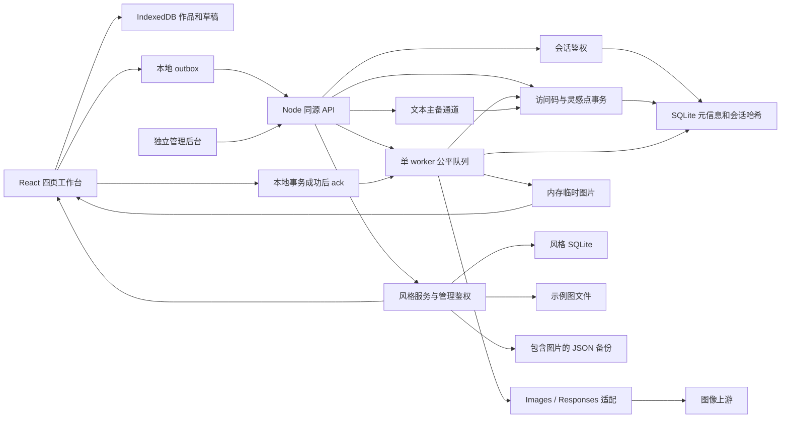

# 功能整改清单与技术架构评估

更新日期: 2026-09-13. 保留原评估 F01-F17, B01-B08, A01-A10 编号, 用 B09-B16 记录后续交互与异常结算整改, 用 F18-F19/A11-A12 记录风格后台与隔离环境, 用 A13 记录小范围使用的五项基础保护, 用 F20-F21/A14-A15 记录访问码, 灵感点与任务收尾, 用 F22 记录后台仪表盘与视觉统一, 用 F23-F24 记录可撤销润色与图片粘贴. 以用户最新决策覆盖 Stitch 中的收藏, 回收站与模型参数假设.

## 1. 当前结论与使用边界

- 保留 React + TypeScript + Vite + Tailwind 和 Node 单进程架构, 采用模块化单体, 图像并发固定为 1.
- 将生成入口, 任务恢复, 本地存储, 参考图/蒙版, 系列交互和部署输入的整改纳入本轮实现.
- 移除用户不需要的作品精选收藏与回收站, 移除未经验证的 Seed/CFG/步数/参考权重入口, 不将这些项目继续列为待补功能.
- 以 36 款/6 类开源素材初始化服务端风格库, 后续由管理员维护图片/提示词/作者及可选分类, 所有数量按已上架数据计算.
- 将生成作品, 参考图和蒙版保存在浏览器, 服务端仅临时中转生成图片. 允许风格素材持久化: 使用独立 SQLite 保存资料与管理会话, 使用文件目录保存示例图, 支持完整备份.
- 保持现有架构与页面, 补齐访问码登录限制与停用/重置, 写接口同源检查, 文本限流, 图片下载地址检查和应用文件日志轮转; 按 DEPLOY 维护固定阈值.
- 按下方验收范围理解完成状态. 不将模拟 Provider 验证等同于真实图像质量, Responses 通道可用性或生产容量保证.

## 2. 原缺失功能清单

状态含义: 已实现表示代码和对应本地验证已接通; 已删除表示按用户决策不再提供; 能力边界表示不向用户承诺上游尚未证明支持的效果.

| 编号 | 功能 | 本轮结果 | 验收与边界 |
|---|---|---|---|
| F01 | 一次生成 2/4 张 | 已实现 | 2/4 个独立幂等任务以整批事务预占受理, 顺序执行并逐项结算回填; 同一上游结果返回多图也完整保存 |
| F02 | 局部蒙版重绘 | 已实现并修复参数继承 | 从原作品继承画幅/质量/背景/格式/压缩率/通道并只读展示, 原图不隐式缩小, 不叠加其他风格, 新增版本保留原作; 已实测当前 Images 通道 |
| F03 | 作品精选收藏与筛选 | 已删除 | 移除已精选标记, 收藏入口和筛选, 不新增收藏存储 |
| F04 | 系列主体与画风一致性 | 参考链已实现, 输入按设计稿简化 | 将主体要求写入梗概/剧本, 取消独立主体设定字段, 保留可选参考图, 后续镜头引用首镜, 首镜本地快照可续交; 不承诺锁脸或绝对一致 |
| F05 | 参考图数值权重 | 已删除 | 官方接口无此字段, 非法值被通道接受不能证明其有效, 不展示数值占位 |
| F06 | 单镜重新绘制 | 已实现 | sceneId 稳定, 新作品保留 version/parentId, 查看器可切换旧版本 |
| F07 | 单镜参数与待执行编辑 | 已实现 | 编辑提示词/画幅/质量/格式, pending 使用 PATCH, 已完成作品创建新版本; 已验证修改进入上游请求 |
| F08 | 队列置顶 | 已实现 | 抽屉和分镜卡均可置顶本人待执行任务, 保留用户间公平轮询 |
| F09 | Seed 保存与复现 | 已删除 | 不展示 Seed 控件/排序/占位, 不承诺随机种子复现 |
| F10 | 完整生成配方 | 已实现 | 保存实际提示词, 模型, 通道, 风格/调性, 目标尺寸, 质量, 背景, 格式, 压缩率, 参考图和蒙版; 移除 CFG/步数 |
| F11 | 分享作品或系列 | 已按本地文件方案实现 | 支持时调用系统文件分享, 不上传图片生成公开链接; 自动测试验证传入原始文件, 不操作真实系统分享目标 |
| F12 | 按系列模板分类 | 已实现 | 持久保存四类 template, 展馆按绘本/电商/视频分镜/品牌 IP 筛选 |
| F13 | 回收站与恢复 | 已删除 | 直接永久删除本地作品, 删除系列包含旧版本, 保存消费记录防止刷新重现 |
| F14 | 会话与退出 | 已实现 | 访问码登录与只读访问名称, 用户浮窗收纳主题/帮助/退出; 同码共享余额和名称且任务独立, 退出仅影响当前会话 |
| F15 | 帮助内容 | 已实现并精简 | 合并创作, 下载, 本地保存, 共享灵感点与队列恢复说明, 移除通道详情和空栏目 |
| F16 | 通道健康状态 | 服务端保留, 前台移除 | 保留未验证/可用/最近失败/冷却判定, 顶栏和帮助不展示运维状态, 保留实际错误反馈 |
| F17 | 百分比与准确剩余时间 | 按能力边界收敛 | 显示真实状态, 已用时间与队列位次, 不提供假百分比和准确剩余秒数 |
| F18 | 风格后台 | 已实现 | 从独立地址登录, 用户端不展示管理入口; 图片上传/拖拽/剪贴板粘贴, 完整原文和作者, 可选名称/分类/来源/排序, 上下架与删除 |
| F19 | 风格备份迁移 | 已实现 | 包含图片与文本的 JSON 导出, 导入预览后事务合并, 相同内容幂等, 版本冲突与整库容量校验 |
| F20 | 访问码与灵感点 | 已实现 | 安全随机码, 无有效期, 多人共享余额且任务隔离, 批次预占, 成功扣除/明确失败返还, 文字/图片幂等与未知结果核实 |
| F21 | 额度管理与前端提示 | 已实现 | 整卡编辑, 卡片用量图标打开独立明细; 点数输入与无限开关合并, 批量发码及访问名称/加减点/启停/重置/删除, 点值设置与分页流水; 删除/重置无需原因且自动记录, 冲突时才显示刷新数据, 在途任务保留原额度模式 |
| F22 | 后台仪表盘与统一视觉 | 已实现 | 沿用前台品牌和语义色; 365 天真实创作热力图, 灵感点与创作次数按今日/本月/累计切换; 风格四列整卡编辑, 全部表单字段展开; 管理子页支持刷新与前进后退 |
| F23 | 可撤销提示词润色 | 已实现 | 最近一次前后版本随草稿保存, 撤销/恢复保留两侧手工修改且不扣点; 更新完整指令, 取消一句话/60 字限制, 先校验结果再结算, 本地保存失败与指令升级复用原请求 |
| F24 | 单图参考区图片粘贴 | 已实现 | 空区支持上传/拖拽/粘贴, 连续输入只载入首张; 已有参考图/蒙版时忽略且不弹窗, 保留手动更换与普通文字粘贴, 原图不隐式压缩 |

## 3. 原有行为差异

| 编号 | 原问题 | 本轮结果 |
|---|---|---|
| B01 | 比例与像素标签矛盾 | 16:9 使用目标 1280x720, 9:16 使用 720x1280, 21:9 使用对齐约束下的近似 1280x544; 结果显示实际文件尺寸. 局部编辑继承原目标尺寸, 不被默认 1:1 或比例重算覆盖. 当前通道不承诺精确像素 |
| B02 | 质量/格式默认值不一致 | 单图与系列统一 medium/png, 控件和配方同步, 恢复草稿后再开放编辑 |
| B03 | 系列拆解规则与生成流程 | 每种模板使用独立规则, 严格校验 3-8 幕 JSON 计划. 拆解只生成可编辑提示词, 用户逐镜检查后确认生成, 使用修改后的提示词和本镜参数; 刷新与快捷键不自动生图 |
| B04 | 风格计数虚构/重复 | 首次从指定仓库整理 36 款/6 类, 保留来源署名; 后续通过服务端已上架目录动态统计, 不采用静态计数 |
| B05 | 清空已完成刷新后恢复 | 使用持久归档 API, 与删除作品分离 |
| B06 | 运行中取消无效 | pending 可取消, running 明确显示上游执行中, 不承诺撤回已经发送的请求 |
| B07 | 格式/透明信息与文件不符 | 保留透明参考素材, 拒绝 transparent+JPEG, 检查真实 MIME/尺寸, 下载真实扩展名, 当前通道限制 PNG |
| B08 | 系列部分提交失败无法续交 | 持久 outbox + 稳定分镜 ID + requestId 幂等, 服务端整批受理, 丢响应后查回已受理项, 刷新后只续交缺失部分 |
| B09 | 重试后旧失败画稿重复占位 | 新任务确认入队后接替原占位, 历史保留重试关系; 提交失败仍保留原卡, 重复点击只提交一次, 刷新/归档/删除作品不恢复旧失败卡 |
| B10 | 生成完成后仍恢复旧草稿 | 全部关联请求的图片成功保存后结束草稿, 下次刷新或进入清空文案和参考素材, 保留常用设置; 未完成草稿及生成期间的新输入继续恢复, 提供新建创作/新建系列 |
| B11 | 完整模板与独立画风混用 | 按录入原文展示/复制/发送单图, 不追加隐藏画风或自动翻译; 移除系列风格库选择入口, 从梗概画面要求与首镜参考保持连贯 |
| B12 | 上游异常与可用结果判断影响点数 | 统一图片/文字错误分类, 网关超时不自动重试; 识别 HTTP 200 错误正文和 Responses 失败事件, 拒绝截断 JPEG; 系列 JSON/幕数/必填内容通过服务端校验后才扣文字点数 |
| B13 | 单图画卷堆积全部作品, 左侧滚轮先带动右侧 | 限制为最近 4 个记录, 当前批次优先且任务/结果原位替换; 取消左侧吸顶并使用整页滚动, 从独立入口访问完整展馆 |
| B14 | 提示词双描边与润色过程缺少反馈 | 聚焦仅保留外层轮廓, 润色期间使用植物绿边框流光并只读, 禁用清空/重复润色/生成; 减少动态效果时使用静态描边 |
| B15 | 无限额度按钮文案冗余与顶栏透感不足 | 无限操作隐藏按钮点数标记, 仅在顶栏显示无限灵感点, 有限及历史任务按实际模式展示; 四页顶栏统一 80% 纸面底色和 24px 背景模糊 |
| B16 | 访问码删除/重置步骤偏多, 常态显示技术按钮 | 移除删除/重置原因输入, 保留一次确认并自动记录; 仅在版本冲突时显示刷新数据, 保留编辑且不自动保存或执行, 普通网络错误沿用原编号重试 |

## 4. 多余功能与清理结果

| 对象 | 结果 |
|---|---|
| 单图结果悬浮条上的额外切图按钮 | 移至卡片二级工具菜单, 保留纯前端切图能力 |
| 旧 50 基础风格 + 30 高级模板 | 删除旧数据, 迁移到服务端风格库, 保留初始来源并清理无引用旧图片 |
| 精选收藏, 回收站 | 按用户要求移除, 不新增相应数据和管理流程 |
| Seed/CFG/步数/权重与模拟进度 | 从产品控件和当前需求中移除, 仅在验证报告中保留技术结论 |
| 完整个人资料/头像与生态更新栏目 | 使用访问码用户浮窗与合并帮助, 不增加个人资料系统 |
| 旧 `/api/responses` 生图直通 | 删除, 全部生成经过唯一队列入口 |
| 旧 `/api/images/*`, `/api/jobs/images/*`, `/api/models` | 删除过期公开路由, 新请求统一 `/api/jobs` 与 `/api/jobs/batch` |
| 未使用的 `useProviders.ts` | 删除, 后端多 Provider 路由保留 |
| 失效的 `tests/param-smoke.test.js` | 删除, 有效参数校验迁入领域契约测试 |
| Dockerfile 的 js/css COPY | 删除失效输入, 补齐 Tailwind/PostCSS/shared, 与本地构建使用相同源码 |
| 风格标签, 英文名与独立画风描述 | 移除冗余数据字段, 以图片/完整提示词/作者为主, 分类可留空 |
| 系列的风格库选择器 | 移除, 将画面要求写入梗概/分镜, 保留可选参考图与首镜参考链 |
| 登录, 原图下载, 本地展馆, 参数复用 | 保留, 服务于现有工具定位 |
| 视频生成, LoRA 训练, 协作/充值支付, 重图层编辑 | 保持范围外 |

## 5. 工程整改清单

| 编号 | 原问题 | 本轮结果与验证 |
|---|---|---|
| A01 | 异步请求异常可终止进程 | 统一捕获路由 Promise, 非法 Cookie/JSON/超限体返回 4xx, 验证后进程继续可用 |
| A02 | Docker 构建输入失效 | 修复多阶段构建, 容器监听地址与健康检查; 本地/容器 CSS 和 JS 哈希一致 |
| A03 | 删除后重现与时间漂移 | 图片写入和 job 消费同一事务, 保存 finishedAt, 删除后刷新不重现 |
| A04 | 存储失败误报成功 | 等待事务完成后更新 UI/ack, 同步异常也 abort; 两张图片的第二次写入失败时零部分保存, 恢复后只保存一次 |
| A05 | 重启丢失任务和会话 | SQLite 元信息与哈希会话, pending 可从本地恢复, running 明确结果未知; 生成图片不落服务端磁盘, 重启后未领取图片会过期 |
| A06 | 50 条截断遗漏任务 | 活动/未领取完整返回, 历史游标分页; 已验证全局 60 个排队项以及同一用户 51 个未领取结果 |
| A07 | 生图可绕过单 worker | 删除直通/别名入口, 统一领域提交与服务端适配 |
| A08 | 配方不足/格式与 URL 保存不可靠 | 配方快照, 真实图片头/MIME/尺寸, 上游 URL 先取回文件, 本地 Blob 保存成功才 ack |
| A09 | 批次无幂等/续交语义 | 稳定 Series/Scene/Generation/Artifact 身份, outbox, requestId, 单镜版本与仅续交未受理项 |
| A10 | 测试和文档不足 | 增加配置/契约/HTTP/重启测试, 浏览器交互, Docker 验收和 CI 配置, 同步需求/设计/部署/能力报告 |
| A11 | 风格仍编译在前端 | 后端 SQLite 与示例图目录, 首次初始化标记, 更新不覆盖编辑/删除; 哈希去重与无引用清理, 图片写失败事务回滚 |
| A12 | 本机测试与 Docker 相互影响 | 独立数据/日志/端口/管理员凭据, 独立 Cookie 名称避免同主机不同端口覆盖登录; 同一浏览器实际验证 |
| A13 | 小范围对外使用缺少基础保护 | 普通登录失败限速与访问码撤销, 普通/管理写请求统一同源检查, 文本并发与频率限制, 上游图片 DNS/重定向检查, 有界文件日志与轮转; 不增加依赖或配置字段 |
| A14 | 共享密码无额度且可伪造浏览器身份 | 服务端随机浏览器身份与访问码分离, 任务和预占同事务, 文字幂等复用, 账本独立保留; 断网不新建重复批次, 结算写失败仅重试存储 |
| A15 | 浏览器断开后任务收尾与清理失败 | 关闭服务时等待已断开连接的文字任务及待落账重试, 不提前退出; 图片过期/历史清理写失败可恢复, 不重复调用或退款; 文字重新打开时先读取原请求结果 |

- 拆分原 server.mjs 的配置, HTTP, 鉴权和文本职责, 拆出 Provider 适配和图片处理.
- 将系列业务移到 useSeriesStudio, 保存带版本的草稿, 避免挂载时覆盖新输入.
- 为统一领域请求提供 `.mjs` 运行时校验和 `.d.mts` 类型, 浏览器不再选择底层 HTTP 图片协议.
- 增加全局 128 / 每用户 32 的等待任务上限和 128 MiB 保留字节预算, 保持单 worker.
- 将 IndexedDB 原图和元信息分离, 使用 Blob, 索引分批读取, 可见缩略图加载与按需原图读取.
- 修复环境变量在完整 Provider 数组中不生效的问题, 只覆盖指定主通道, 保留备用通道独立配置.
- 明确区分参考图生成与局部重绘. 前者允许调整构图/比例/风格, 后者使用独立修改要求和原参数. 清空蒙版后禁止提交, 显式切换参考图生成才解除参数固定.
- 统一单图卡片, 展馆查看器和系列的编辑入口. 对无历史配方的图片显示当前使用的自动尺寸/默认质量, 不编造原始参数.

## 6. 当前技术栈与架构评估

| 层次 | 当前实现 | 评估 |
|---|---|---|
| 前端 | React 19.2.6, TypeScript 6.0.3 strict, Vite 8.0.16 | 适合交互型创作工具, 无需 SSR. 保持现有技术栈 |
| 样式 | Tailwind 3.4.17, PostCSS 8.5.28, 语义 token, 本地字体/图标 | 能保持 Stitch 视觉, 构建不依赖 CDN 或设计目录 |
| 状态 | 四页 hash 导航, 业务 hooks, IndexedDB 草稿/outbox | 适合当前规模, 已处理异步恢复和重复提交, 不需要新增全局状态框架 |
| 本地存储 | IndexedDB v4, 元信息/Blob/缩略图/消费/outbox/草稿分离 | 符合生成作品仅在浏览器保存的定位. 原图按需读取, 本地空间失败可见 |
| 服务端 | Node.js >=22.13 原生 HTTP + ESM, 无第三方服务端运行依赖 | 外部 API I/O 为主, 模块化单体便于维护 |
| 持久化 | Node 内置 SQLite, 任务/点数同库事务, 风格独立库与示例图文件 | 原子预占和结算适合当前单实例; 无额外数据库服务, 完整 data 备份包含额度账本 |
| 调度 | 单 worker, 用户内 FIFO/置顶, 用户间公平轮询, 熔断 | 适合当前上游配额约束, 不能直接水平扩容 |
| 上游 | Images / Responses 适配, Chat Completions 文本通道 | 统一契约和密钥边界合理, 对真实能力限制必须单独记录 |
| 登录 | 安全随机访问码 + 服务端浏览器 Cookie; 独立管理员密码与会话 | 同码共享点数, 浏览器任务权限独立, 凭据仅存哈希; 停用/重置及时阻止新调用, 保留在途结果领取 |
| 测试/部署 | Node 原生测试, Playwright, Node 22 Docker, PM2 fork, CI 文件 | 本地可验证完整链路; 远端 CI 需正常推送后执行 |

### 6.1 保持的边界

- 保持一个进程/一个容器实例, 不用多 worker 绕过并发 1. 当前不需要微服务, Redis 集群或 Kubernetes.
- 让生成作品/参考图/蒙版留在浏览器, 接受重启丢失未领取内存图片的边界. 仅把管理员维护的示例素材持久保存, 不扩展为云端作品库.
- 在风格新增/修改/备份合并前计算完整导出容量, 保证可导入恢复. 拒绝超限时保留已有库, 具体限制与迁移规则在 DEPLOY 中维护.
- 将后台限定为风格与访问码/灵感点管理. 不增加模型通道配置, 注册账户, 支付, IP 历史或多级分类/标签. 保持访问码与任务身份分离, 不因多人共享而暴露彼此任务.
- 当前前端通过索引分批读取全部作品元信息, 并非无限规模虚拟图库. 原图不全量驻留内存, 但未做大容量作品库和多用户压力测试.
- 将 128 MiB 解释为保留请求/结果的预算, 不当作整个 Node 进程的最大内存; 解码和临时对象仍消耗额外内存.
- 将通道健康理解为近期调用观测, 不当作实时 SLA. 重启后通道先显示未验证.
- 将已知上游拒绝与结果未知分开处理, 不把网络失败自动等同于可安全重新付费生成.

## 7. 仍受外部条件限制的事项

| 事项 | 当前可用范围 | 限制原因 |
|---|---|---|
| 当前通道输出格式 | PNG 生成与真实格式下载 | 实测 JPEG/WebP 请求均返回 PNG, 已从当前通道选项收起 |
| 当前通道精确像素 | 设置目标画幅, 查看/下载实际文件 | 请求 1024x1024 返回 1254x1254, 请求 1280x720 返回 1672x940 |
| Responses 实际生图 | 适配与模拟协议测试通过 | 当前未提供真实 Responses 生图通道, 无真实上游效果结论 |
| 主体一致性和蒙版外保持 | 参考链和局部编辑可用 | 生成模型仍可能改变细节, 不保证绝对一致或蒙版外像素完全不变 |
| 系统分享 | 支持 Web Share 文件分享的浏览器 | 系统/浏览器能力不同, 自动测试仅验证正确传入原图 |
| 远端 CI / 正式部署 | 流程已配置, 本地独立验收 | 推送后检查远端 Verify, 正式部署需在目标环境另行验收 |
| 生产容量 | 当前小范围单实例架构 | 未做容量压测, 不给未经验证的用户数或作品上限 |

这些属于明确的能力/验收边界. 不恢复收藏, 回收站或无效参数来填充功能数量.

## 8. 验证记录

将先前验收记录保留为历史证据. 以本节末尾的最新验证范围和报告核对当前版本, 不以旧共享密码流程代表当前登录行为.

### 8.1 访问码改造前的验收记录

- [x] 配置环境变量覆盖, 领域契约, 图片格式/蒙版校验, 四模板规划规则.
- [x] Images/Responses 适配, 路由, 熔断, 用户隔离, 幂等, 公平调度, 待执行编辑/置顶, 领取与分页.
- [x] 进程异常请求存活, SQLite 会话持久化, pending 恢复, running 结果未知不重发, 任务数据库无生成图片与明文 token.
- [x] 浏览器 32 组检查, 42 次虚拟图像请求: 多图, 原子保存, 删除后刷新, 蒙版, 系列确认/续交/版本/编辑/衍生, 风格回填, 格式与调性, 失败重试, 草稿生命周期, 旧数据迁移, 系统分享调用和存储错误.
- [x] 验证系列按设计稿统一输入梗概/剧本, 清理旧草稿独立主体字段, 将主体特征带入拆解和各幕请求; 保留可选参考图上传/恢复/移除与首镜参考链, 检查手机完整配置区的深浅主题和按钮边界.
- [x] 验证系列拆解只生成文字, 确认前不创建图片任务/outbox; 验证双击, 快捷键, 缺失提示词, 待确认稿恢复与重拆取消/失败. 确认生成使用修改后的提示词及本镜参数, 并继续支持部分失败续交和首镜参考.
- [x] 验证原作品 16:9 的局部编辑: 创作页切到 1:1/其他质量/格式/风格后仍继承原配方; 刷新不丢失; 上游收到原始 1672x940 文件和等尺寸蒙版, 不混入当前页风格词.
- [x] 验证清空蒙版后禁止提交, 显式切换参考图后开放画幅/风格, 展馆编辑入口继承一致, 系列编辑保留分镜身份并新增版本.
- [x] 四页在桌面/平板/手机与深浅主题下的截图, 关键按钮边界, 无页面脚本错误.
- [x] ZIP 每项 CRC 与原图格式检查.
- [x] 真实默认通道 5 个串行请求, 结果详见 [能力报告](REAL_API_VALIDATION.md).
- [x] 重新构建 Docker 镜像并完成 9 项验收, Node 22.23.2; 本地/容器 JS/CSS 哈希一致, 会话恢复与健康检查通过. 验证风格增删改, 容器重建保留图片/修改且不恢复删除项, 备份导入恢复.
- [x] 新增管理浏览器 11 组验收: 真实图片/文本剪贴板, 上传/拖拽, 自动命名, 原文复制/发送单图, 分类/排序/上下架同步, 保存失败/版本冲突/会话恢复, 备份导入导出, 同浏览器跨端口登录隔离, 桌面/手机深浅主题与图标检查.
- [x] 本机入口测试验证独立目录, 密码文件 0600 权限, 重启复用密码与数据, 环境变量密码提示和独立 Cookie 名称.
- [x] 本机手动测试服务的实际页面验收通过: 工作台与管理登录, 初始 36 款图片, 单 worker/PNG 能力显示和独立 Cookie 均正常, 无页面脚本错误或真实生图请求; 报告在 `/tmp/sprout-style-admin-local/`.
- [x] 接口测试覆盖完整风格读写, 损坏备份原子拒绝, 两环境迁移, 文件写失败回滚和整库备份容量校验; npm test 共 35 项通过并完成严格类型检查/构建.
- [x] 验证普通登录失败限速, 访问密码轮换与重启后旧会话失效, 拒绝旧凭据的在途登录; 升级旧数据库时保留任务, 仅撤销未绑定凭据的旧会话.
- [x] 验证写请求来源和 JSON 媒体类型, Vite 代理保留原始 Host, 文本同一身份/全局的并发与频率限制及失败后释放名额.
- [x] 验证上游图片私网/保留网段/编码 IP/IPv6 拒绝, DNS 固定和重定向重检, 下载预算和结果未知不自动重复生图; 验证日志大小/份数/顺序/重启, 文件写失败与恢复和待写内存限制.
- [x] 在最终代码上重跑 Linux Chromium 工作台 32 组与管理页 11 组检查, 重建镜像后完成 Docker 9 项验收; 全部使用隔离数据和虚拟上游.
- [x] 在无活动任务和待领取结果时更新本机 Docker, 完成 6 项实际服务检查: 旧登录失效与原密码重新登录, 来源/媒体类型边界, 管理权限隔离, 部署文件一致, 原有 56 款风格及其图片和 50 条任务元信息保留. 配置文件哈希不变, 未新增付费请求.
- [x] 移除用户端风格库的管理按钮及跳转回调, 在本机 Docker 的桌面/手机页面确认无管理入口, 独立后台地址可登录且权限仍隔离; 重跑 35 项自动测试, 浏览器 32 + 11 组检查与 Docker 9 项验收.

执行入口: `npm test`, `npm run test:browser`, `docker build -t sprout-canvas:verify .`, `npm run test:docker`.
最新工作台浏览器报告: `/tmp/sprout-admin-entry-browser/`, 管理页报告: `/tmp/sprout-admin-entry-browser/style-admin/`. Docker 报告: `/tmp/sprout-admin-entry-docker/`, 构建日志: `/tmp/sprout-admin-entry-docker-build.log`. 自动测试日志: `/tmp/sprout-admin-entry-tests.log`. 本机入口分离验收报告与截图: `/tmp/sprout-admin-entry-local/`.

保留五项基础保护的首次升级报告 `/tmp/sprout-minimal-security-local-report.json` 和升级前临时数据备份 `/tmp/sprout-security-upgrade-iDPdNE/`. 真实模型历史产物仍见 `/tmp/sprout-real-capabilities/` 和 `/tmp/sprout-real-domain-check/`; 本次未新增付费生图请求. 按 DEPLOY 维护本机手动测试与 Docker 的独立入口和凭据.

在当前分支保留本轮实现及验收记录, 获得用户授权后再提交或推送. 推送后核对远端 Verify 状态, 在真实生产发布前单独完成目标环境验收.

### 8.2 访问码与灵感点版本验收, 2026-09-12

- [x] 完成 [80 项访问码与灵感点清单](ACCESS_CODE_CREDITS_PLAN.md), 保持无有效期, 多人共享余额, 浏览器任务隔离和独立管理员权限.
- [x] 运行 50 项 Node 测试并完成前端构建. 覆盖批次原子预占, 幂等结算, 文字真实超时等待与重启, 数据库写失败只重试入账, 旧会话迁移, 历史任务清理后账本仍稳定.
- [x] 在本机 Chrome 和同版本 Linux Chromium 分别通过工作台 32 组, 风格后台 11 组和访问码/额度 7 组. 覆盖旧版 outbox, 清除 Cookie, 换码确认, 丢响应刷新后复用新请求, 系列首镜重连, 零余额免费操作, 最大允许余额与桌面/平板/手机深浅主题布局.
- [x] 在最新隔离镜像上通过 Docker 12 项检查, 验证 Node 22.23.2 下的账本/点值/停用状态持久化, 整卷备份恢复, 来源限流, 管理权限与 SQLite 文件权限.
- [x] 在无活动任务和待领取图片时停机备份, 更新本机 Docker. 实际入口验证管理员与访问码登录, 零余额浏览, 权限隔离, 前后端资产一致. 保留原有 56 款风格, 56 张示例图及 50 条任务记录, 配置文件哈希不变.
- [x] 更新 README 的 8 张预览, 保留页面靠前且不折叠, 将单图主预览高度限制到左侧功能区. 验证本次实际服务与截图流程均未发起真实模型调用.
- [x] 运行 `git diff --check`, 保留当前分支未提交改动, 不自动提交或推送.

使用本次报告复核结果: Node 日志 `/tmp/sprout-credits-final-tests.log`; 本机浏览器 `/tmp/sprout-credits-final-browser/`; Linux 浏览器 `/tmp/sprout-credits-final-linux/`; Docker `/tmp/sprout-credits-final-docker/docker-report.json`; 实际服务 `/tmp/sprout-credits-local-upgrade/report.json`. 保留停机备份 `/Users/lu/.local/share/sprout-canvas/backups/access-credits-20260912-9wL6uS/`.

使用原管理员密码进入 `http://127.0.0.1:8888/#admin` 创建首批访问码. 保持默认图片 10 点, 文字 1 点, 由管理员按测试需要调整; 将验收用零额度码保持停用, 不自动发放无限额度.

### 8.3 异常结算补充验收, 2026-09-12

- [x] 验证图片/文字的明确拒绝, 网关超时, 未连接成功, 中途断流, HTTP 200 错误正文与 Responses 终止事件; 同时核对上游调用次数, 请求编号, 可用/预占/累计消费与流水次数.
- [x] 验证截断 JPEG 不直接扣成功点数, 无效 JSON/不完整系列草稿返还文字预占. 在服务端和浏览器复用同一分镜解析规则.
- [x] 验证多图部分成功/失败, 排队取消, 首镜失败与结果未知时的后续分镜返还, 原请求重放和连续点击重试.
- [x] 验证生成中刷新, 关闭标签页及退出整个浏览器后的结果恢复; 领取确认丢失不重复保存, 原文字请求优先读取, 未知结果重新处理需确认.
- [x] 验证图片过期和历史清理写失败恢复, 浏览器断开后的文字收尾, 关闭服务时等待待落账操作, 不为恢复存储重复调用模型.
- [x] 通过 84 项 Node 测试与构建, Node 22 容器的 34 项异常专项, 本机 Chrome 与 Linux Chromium 各 32 + 11 + 7 + 8 组浏览器检查, 独立 Docker 12 项验收.
- [x] 在无活动任务, 待落账操作和未领取图片时备份并更新本机 Docker. 核对运行中的前后端文件哈希, 原配置与点数数据保持不变, 原有 56 款风格/56 张示例图/50 条任务保持完整. 实际验收未调用付费模型.

使用 [异常结算清单](ACCESS_CODE_CREDITS_PLAN.md#10-异常结算整改) 查看逐场景规则与报告. 保留本次完整备份 `/Users/lu/.local/share/sprout-canvas/backups/credit-exceptions-20260912-1wQl1N/` 和实际服务报告 `/tmp/sprout-credit-exceptions-release/report.json`.

### 8.4 无限额度与管理交互验收, 2026-09-12

- [x] 验证有限/无限额度模式, 在途快照结算, 旧模式报价拒绝, 同码共享使用, 删除及旧数据库迁移.
- [x] 验证卡片统一编辑弹窗, 版本冲突, 会话过期恢复, 删除确认和按钮内点数标记, 检查桌面/平板/手机深浅主题.
- [x] 通过 91 项 Node 测试与构建, Node 22 额度专项 15 项, 本机 Chrome 与 Linux Chromium 各 60 组浏览器检查, Docker 13 项验收.
- [x] 备份并更新本机 Docker, 保留原配置, 原访问码与账本, 56 款风格/56 张示例图/50 条任务. 删除本轮临时验收码, 不调用真实付费模型.

使用 [额度与界面记录](ACCESS_CODE_CREDITS_PLAN.md#11-无限额度-删除与管理交互) 核对规则与报告.

### 8.5 后台视觉与仪表盘验收, 2026-09-12

- [x] 统一后台登录, 顶栏, 页面标题, 搜索栏, 素材/额度卡片与编辑弹窗, 复用前台语义色和字体. 验证桌面/平板/手机深浅主题, 密码显隐和子页刷新/前进后退.
- [x] 验证仪表盘读取真实全量统计, 区分有限额度实际扣减和无限额度等值用量, 排除预占/返还/待核实, 保留已删除码的历史结算. 验证管理员权限与读取失败/会话失效状态.
- [x] 验证最近风格直达对应编辑表单, 待核实事项直达对应访问码用量明细, 处理后刷新统计且不重复扣点.
- [x] 通过 93 项 Node 测试与构建, Node 22 容器 9 项概览/额度专项, 本机 Chrome 与 Linux Chromium 各 67 组浏览器验收, Docker 13 项验收.
- [x] 在无活动任务和未领取结果时备份并更新本机 Docker. 核对升级前后配置, 访问码, 点值, 账本, 56 款风格/56 张示例图/50 条任务的完整性, 并在实际服务验证登录, 仪表盘, 管理弹窗与前端资源哈希. 不调用真实付费模型.
- [x] 同步 README 的登录/仪表盘/管理页面预览图和功能说明, 保留已有用户端预览排版.

保留完整备份 `/Users/lu/.local/share/sprout-canvas/backups/admin-ui-20260912-73y8Eb/`, 本机浏览器报告 `/tmp/sprout-admin-redesign-browser/`, Linux 浏览器报告 `/tmp/sprout-admin-redesign-linux/`, Docker 报告 `/tmp/sprout-admin-redesign-docker/docker-report.json` 与实际服务报告 `/tmp/sprout-admin-redesign-release/report.json`.

### 8.6 后台交互与时间统计验收, 2026-09-12

- [x] 合并初始点数/调整点数与无限额度开关, 开启时禁用输入, 切回有限保留输入. 从访问码卡片图标打开独立流水与核实弹窗, 验证点击和键盘操作不会误开设置.
- [x] 使用电脑四列, 中屏三列, 平板两列和手机单列风格卡片. 验证卡片文字区域与键盘均可打开编辑, 上下架/删除保持独立; 展开全部表单字段, 保留图片上传/拖放/粘贴, 版本冲突和会话恢复.
- [x] 使用最近 365 天成功结算记录生成热力图, 按北京时间聚合. 验证跨日/月/年, 闰日, 未完成任务排除, 重复结算, 历史点值/模式, 已删除码与结果清理. 在灵感点用量和创作卡片分别切换今日/本月/累计, 保留当前库存和待核实统计.
- [x] 通过 94 项 Node 自动测试和 TypeScript/Vite 构建, Node 22 专项 10 项, 本机 Chrome 与 Linux Chromium 各 68 组, 独立 Docker 13 项. 检查窄屏热力图定位, 深浅主题, 图标和弹窗边界.
- [x] 在无活动任务和未领取结果时完成备份与本机 Docker 更新. 核对 56 款风格, 56 张示例图, 51 条任务记录和 3 个未删除访问码; 比较完整配置, 风格文本/文件, 任务及额度账本摘要, 验证前后端资源与实际管理交互一致. 保留既有数据, 不调用真实模型.
- [x] 更新 README 的仪表盘, 风格列表, 访问码列表与风格编辑预览, 使用隔离测试数据; 同步 PRD, DESIGN, DEPLOY 和项目约束.

保留备份 `/Users/lu/.local/share/sprout-canvas/backups/admin-refinements-20260912-P3RAks/`, Node 报告 `/tmp/sprout-admin-refinements-tests.log`, Chrome 报告 `/tmp/sprout-admin-refinements-browser-final/`, Linux 报告 `/tmp/sprout-admin-refinements-linux/`, Docker 报告 `/tmp/sprout-admin-refinements-docker/docker-report.json` 和实际服务报告 `/tmp/sprout-admin-refinements-release/report.json`. 保持当前分支的未提交改动, 按用户授权再提交.

### 8.7 前台用户浮窗与近期画卷验收, 2026-09-12

- [x] 加粗顶栏灵感点, 移除通道健康状态, 用用户浮窗收纳访问名称, 脱敏尾号, 深浅色, 使用帮助与退出. 验证外部点击, Esc/Tab 关闭, 帮助关闭后焦点恢复, 主题刷新记忆和 320px 窄屏布局.
- [x] 从当前会话只读返回访问名称, 后台明确标注用户可见, 空名称显示创作者. 用两个浏览器验证共享码改名自动同步, 长名称换行和退出隔离; 保留设置读取失败的重试入口和未提交输入.
- [x] 将画卷限制为最多 4 个记录, 当前批次优先, 不足补最近作品. 验证排队/生成/保存/失败/成功原位更新, 迟到结果与失败重试去重, 多图输出不挤走本批其他任务, 全部作品和旧任务仍可从展馆与队列访问.
- [x] 取消配置栏吸顶, 验证鼠标位于左右两栏时均滚动整页, 顶栏保持固定; 手机使用单列布局. 更新 README 四张前台预览及当前产品说明.
- [x] 通过 100 项 Node 自动测试与 TypeScript/Vite 构建, 本机 Chrome 与 Linux Chromium 各 75 组浏览器检查, Node 22.23.2 独立 Docker 13 项验收. 使用虚拟上游验证生成与结算, 不调用真实模型.
- [x] 在无活动任务和未领取结果时备份并更新本机 Docker. 核对配置, 56 款风格/56 张示例图, 51 条任务和 3 个未删除访问码及账本摘要保持一致; 验证实际前后端文件哈希, 管理员登录和访问名称字段, 确认服务健康且无页面脚本错误.

保留完整备份 `/Users/lu/.local/share/sprout-canvas/backups/workspace-ui-20260912-WcRZXx/`, Chrome 报告 `/tmp/sprout-workspace-browser-final/`, Linux 报告 `/tmp/sprout-workspace-linux/`, Docker 报告 `/tmp/sprout-workspace-docker/docker-report.json`, 预览报告 `/tmp/sprout-workspace-previews/report.json` 和实际服务报告 `/tmp/sprout-workspace-release/report.json`. 保留当前分支的未提交改动, 按用户授权再提交或推送.

### 8.8 提示词润色与参考图输入验收, 2026-09-12

- [x] 验证润色前后版本切换, 两侧手工修改保留, 刷新恢复, 连续润色与新建/模板切换/图片完成后的清理. 撤销和恢复不调用模型或扣点, 已成功润色不因撤销退点.
- [x] 验证完整原文与新指令传输, 非空和超长结果校验, 明确失败返还, 本地写入失败后的原结果领取. 在指令升级时分别验证已受理结果与尚未送达请求, 保留原编号和内容, 不重复调用; 校验跨标签页草稿冲突与迟到结果保护.
- [x] 使用原生剪贴板验证空区图片粘贴与普通文字粘贴, 已有参考图/蒙版不覆盖且无弹窗, 连续粘贴只载入首张, 手动更换, 拖拽及非法格式恢复. 核对原始像素尺寸, 不因粘贴发起生成.
- [x] 验证提示词单层焦点轮廓, 处理中只读和边框实际运动, 减少动态效果时静态描边, 320px 窄屏与深浅主题. 验证无限操作无按钮标记, 有限操作保留真实扣点, 四页顶栏背景模糊一致; 保持基础画风快捷项移除.
- [x] 通过 101 项 Node 自动测试与 TypeScript/Vite 构建, 本机 Chrome 和同版本 Linux Chromium 各 85 组浏览器检查, Node 22.23.2 独立 Docker 13 项验收. 仅使用虚拟上游, 不将本次检查表述为真实模型文案适配效果验证.
- [x] 在无活动图片/文字和未领取图片时停机备份并更新本机 Docker. 核对原配置, 56 款风格/56 张示例图, 52 条任务, 3 个未删除访问码及账本摘要保持一致; 验证前后端文件哈希和实际管理交互, 服务健康且无页面脚本错误. 不调用真实付费模型.
- [x] 同步帮助, PRD, DESIGN, 额度清单和项目约束, 更新 README 四张前台预览. 保持单图主预览高度与左侧功能区一致, 保留页面预览靠前且不折叠.

保留完整备份 `/Users/lu/.local/share/sprout-canvas/backups/studio-input-20260912-VR2tNW/`, Node 报告 `/tmp/sprout-input-tests.log`, Chrome 报告 `/tmp/sprout-input-browser-final/`, Linux 报告 `/tmp/sprout-input-linux/`, Docker 报告 `/tmp/sprout-input-docker/docker-report.json`, 预览报告 `/tmp/sprout-input-previews/report.json` 和实际服务报告 `/tmp/sprout-input-release/report.json`. 保留当前分支的未提交改动, 按用户授权再提交或推送.

### 8.9 访问码操作简化验收, 2026-09-13

- [x] 移除删除和重置原因输入, 保留一次影响确认, 服务端自动记录操作说明. 验证默认原因, 旧码撤销, 原余额与历史流水保留, 重放不重复重置或删除; 保留运行中/待核实任务的删除限制.
- [x] 从常态设置弹窗移除载入最新版本, 仅在版本冲突时显示刷新数据. 验证保存/重置/删除冲突, 刷新失败可重试, 已编辑字段保留, 未编辑字段同步最新记录; 刷新只读取数据, 经再次确认才执行.
- [x] 模拟加点已成功但响应丢失, 确认不显示版本冲突按钮, 使用相同请求编号重试且只加一次点数. 验证管理会话过期后的输入恢复, 以及桌面/平板/手机深浅主题弹窗.
- [x] 通过 102 项 Node 自动测试与 TypeScript/Vite 构建, 本机 Chrome 和 Linux Chromium 各 85 组浏览器检查, Node 22.23.2 独立 Docker 13 项验收. 全部生成场景使用隔离数据与虚拟上游.
- [x] 在无活动图片/文字和未领取图片时备份并更新本机 Docker. 核对配置, 56 款风格/56 张示例图, 52 条任务, 3 个未删除访问码及账本摘要保持一致; 验证实际确认区无原因输入且常态无刷新按钮, 前后端文件哈希一致, 服务健康且无页面脚本错误. 实际服务验证只打开并取消确认, 不删除/重置原访问码, 不调用真实模型.

保留完整备份 `/Users/lu/.local/share/sprout-canvas/backups/admin-actions-20260913-kVPcBQ/`, Node 报告 `/tmp/sprout-admin-actions-tests.log`, Chrome 报告 `/tmp/sprout-admin-actions-browser/`, Linux 报告 `/tmp/sprout-admin-actions-linux/`, Docker 报告 `/tmp/sprout-admin-actions-docker/docker-report.json` 和实际服务报告 `/tmp/sprout-admin-actions-release/report.json`. 按本节报告核对已验收范围, 远端验证以对应提交的 Verify 结果为准.

## 9. 当前剩余验收与处理清单

按已确认需求核对核心功能实现, 不将本地自动测试通过表述为所有设备和真实模型效果均已验收.

| 事项 | 当前证据 | 后续处理 |
|---|---|---|
| 真实整套系列效果 | 已验证分镜拆解/首镜参考链协议, 真实通道报告包含 5 次单图/参考图/蒙版请求; 尚无整套系列效果验收记录 | 发布前使用实际梗概完成一套系列, 检查主体/风格连续性, 提示词修改和局部编辑效果 |
| 真机与浏览器兼容 | 已验证 Chromium 桌面/平板/手机视口及原生触摸事件, 系统分享使用模拟对象 | 发布前在目标手机和 Safari 实测蒙版, 图片缩放, 复制, 下载/分享和切后台后恢复 |
| 部署与持续验证 | Node 102 项, 本机与 Linux 浏览器各 85 组, Docker 13 项及本机实际升级验收通过; 本机已更新至本次实现 | 推送后核对对应提交的远端 Verify; 迁至其他部署环境时单独验收 |
| 容量与长时间运行 | 已测试 60 个等待任务和 51 个未领取结果的完整性, 尚无容量压测数据 | 扩大用户数或作品库规模前测队列延迟, 内存, 本地存储占用和图库响应 |
| Responses 真实通道 | 适配器与模拟协议通过, 未提供真实可用通道 | 启用该通道前单独验证真实文生图/参考图/蒙版能力; 不影响当前默认 Images 通道使用 |

- 将 PNG 和非精确像素视为已记录的当前上游能力边界, 不列为待恢复的界面选项.
- 对缺少提交关联的既有旧草稿使用新建创作或新建系列清理一次, 不凭相同文案推断完成状态.
- 保持收藏, 回收站和无效模型参数为已删除项, 不再作为缺失功能补回.
