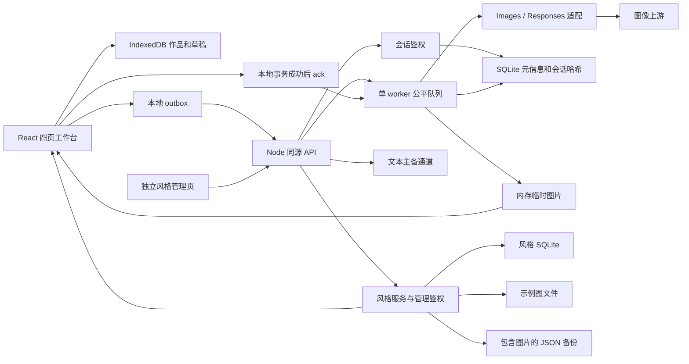

# 功能整改清单与技术架构评估

更新日期: 2026-09-08. 保留原评估 F01-F17, B01-B08, A01-A10 编号, 用 B09-B11 记录后续交互整改, 用 F18-F19/A11-A12 记录风格后台与隔离环境. 以用户最新决策覆盖 Stitch 中的收藏, 回收站与模型参数假设.

## 1. 当前结论与使用边界

- 保留 React + TypeScript + Vite + Tailwind 和 Node 单进程架构, 采用模块化单体, 图像并发固定为 1.
- 将生成入口, 任务恢复, 本地存储, 参考图/蒙版, 系列交互和部署输入的整改纳入本轮实现.
- 移除用户不需要的作品精选收藏与回收站, 移除未经验证的 Seed/CFG/步数/参考权重入口, 不将这些项目继续列为待补功能.
- 以 36 款/6 类开源素材初始化服务端风格库, 后续由管理员维护图片/提示词/作者及可选分类, 所有数量按已上架数据计算.
- 将生成作品, 参考图和蒙版保存在浏览器, 服务端仅临时中转生成图片. 允许风格素材持久化: 使用独立 SQLite 保存资料与管理会话, 使用文件目录保存示例图, 支持完整备份.
- 按下方验收范围理解完成状态. 不将模拟 Provider 验证等同于真实图像质量, Responses 通道可用性或生产容量保证.

## 2. 原缺失功能清单

状态含义: 已实现表示代码和对应本地验证已接通; 已删除表示按用户决策不再提供; 能力边界表示不向用户承诺上游尚未证明支持的效果.

| 编号 | 功能 | 本轮结果 | 验收与边界 |
|---|---|---|---|
| F01 | 一次生成 2/4 张 | 已实现 | 2/4 个独立幂等任务, 顺序执行, 全部回填; 同一上游结果返回多图也完整保存 |
| F02 | 局部蒙版重绘 | 已实现并修复参数继承 | 从原作品继承画幅/质量/背景/格式/压缩率/通道并只读展示, 原图不隐式缩小, 不叠加其他风格, 新增版本保留原作; 已实测当前 Images 通道 |
| F03 | 作品精选收藏与筛选 | 已删除 | 移除已精选标记, 收藏入口和筛选, 不新增收藏存储 |
| F04 | 系列主体与画风一致性 | 参考链已实现, 输入按设计稿简化 | 将主体要求写入梗概/剧本, 取消独立主体设定字段, 保留可选参考图, 后续镜头引用首镜, 首镜本地快照可续交; 不承诺锁脸或绝对一致 |
| F05 | 参考图数值权重 | 已删除 | 官方接口无此字段, 非法值被通道接受不能证明其有效, 不展示数值占位 |
| F06 | 单镜重新绘制 | 已实现 | sceneId 稳定, 新作品保留 version/parentId, 查看器可切换旧版本 |
| F07 | 单镜参数与待执行编辑 | 已实现 | 编辑提示词/画幅/质量/格式, pending 使用 PATCH, 已完成作品创建新版本; 已验证修改进入上游请求 |
| F08 | 队列置顶 | 已实现 | 抽屉和分镜卡均可置顶本人待执行任务, 保留用户间公平轮询 |
| F09 | Seed 保存与复现 | 已删除 | 不展示 Seed 控件/排序/占位, 不承诺随机种子复现 |
| F10 | 完整生成配方 | 已实现 | 保存实际提示词, 模型, 通道, 风格/调性, 目标尺寸, 质量, 背景, 格式, 压缩率, 参考图和蒙版; 移除 CFG/步数 |
| F11 | 分享作品或系列 | 已按本地文件方案实现 | 支持时调用系统文件分享, 不上传图片生成公开链接; 自动测试验证传入原始文件, 不操作真实系统分享目标 |
| F12 | 按系列模板分类 | 已实现 | 持久保存四类 template, 展馆按绘本/电商/视频分镜/品牌 IP 筛选 |
| F13 | 回收站与恢复 | 已删除 | 直接永久删除本地作品, 删除系列包含旧版本, 保存消费记录防止刷新重现 |
| F14 | 会话与退出 | 已实现 | 前端退出, 过期重新登录, SQLite 会话跨重启恢复, 身份存储不可用时显示错误 |
| F15 | 帮助内容 | 已实现并精简 | 合并创作, 下载, 本地保存, 队列恢复和通道说明, 移除空栏目 |
| F16 | 通道健康状态 | 已实现 | 区分未验证/可用/最近失败/冷却, 展示本次进程调用状态 |
| F17 | 百分比与准确剩余时间 | 按能力边界收敛 | 显示真实状态, 已用时间与队列位次, 不提供假百分比和准确剩余秒数 |
| F18 | 风格后台 | 已实现 | 独立管理登录, 图片上传/拖拽/剪贴板粘贴, 完整原文和作者, 可选名称/分类/来源/排序, 上下架与删除 |
| F19 | 风格备份迁移 | 已实现 | 包含图片与文本的 JSON 导出, 导入预览后事务合并, 相同内容幂等, 版本冲突与整库容量校验 |

## 3. 原有行为差异

| 编号 | 原问题 | 本轮结果 |
|---|---|---|
| B01 | 比例与像素标签矛盾 | 16:9 使用目标 1280x720, 9:16 使用 720x1280, 21:9 使用对齐约束下的近似 1280x544; 结果显示实际文件尺寸. 局部编辑继承原目标尺寸, 不被默认 1:1 或比例重算覆盖. 当前通道不承诺精确像素 |
| B02 | 质量/格式默认值不一致 | 单图与系列统一 medium/png, 控件和配方同步, 恢复草稿后再开放编辑 |
| B03 | 系列拆解规则与生成流程 | 每种模板使用独立规则, 严格校验 3-8 幕 JSON 计划. 拆解只生成可编辑提示词, 用户逐镜检查后确认生成, 使用修改后的提示词和本镜参数; 刷新与快捷键不自动生图 |
| B04 | 风格计数虚构/重复 | 首次从指定仓库整理 36 款/6 类, 保留来源署名; 后续通过服务端已上架目录动态统计, 不采用静态计数 |
| B05 | 清空已完成刷新后恢复 | 使用持久归档 API, 与删除作品分离 |
| B06 | 运行中取消无效 | pending 可取消, running 明确显示上游执行中, 不承诺撤回已经发送的请求 |
| B07 | 格式/透明信息与文件不符 | 保留透明参考素材, 拒绝 transparent+JPEG, 检查真实 MIME/尺寸, 下载真实扩展名, 当前通道限制 PNG |
| B08 | 系列部分提交失败无法续交 | 持久 outbox + 稳定分镜 ID + requestId 幂等, 只续交未受理部分; 已验证第三幕提交失败后刷新恢复 |
| B09 | 重试后旧失败画稿重复占位 | 新任务确认入队后接替原占位, 历史保留重试关系; 提交失败仍保留原卡, 重复点击只提交一次, 刷新/归档/删除作品不恢复旧失败卡 |
| B10 | 生成完成后仍恢复旧草稿 | 全部关联请求的图片成功保存后结束草稿, 下次刷新或进入清空文案和参考素材, 保留常用设置; 未完成草稿及生成期间的新输入继续恢复, 提供新建创作/新建系列 |
| B11 | 完整模板与独立画风混用 | 按录入原文展示/复制/发送单图, 不追加隐藏画风或自动翻译; 移除系列风格库选择入口, 从梗概画面要求与首镜参考保持连贯 |

## 4. 多余功能与清理结果

| 对象 | 结果 |
|---|---|
| 单图结果悬浮条上的额外切图按钮 | 移至卡片二级工具菜单, 保留纯前端切图能力 |
| 旧 50 基础风格 + 30 高级模板 | 删除旧数据, 迁移到服务端风格库, 保留初始来源并清理无引用旧图片 |
| 精选收藏, 回收站 | 按用户要求移除, 不新增相应数据和管理流程 |
| Seed/CFG/步数/权重与模拟进度 | 从产品控件和当前需求中移除, 仅在验证报告中保留技术结论 |
| 完整个人资料/头像与生态更新栏目 | 使用退出和合并帮助替代空入口 |
| 旧 `/api/responses` 生图直通 | 删除, 全部生成经过唯一队列入口 |
| 旧 `/api/images/*`, `/api/jobs/images/*`, `/api/models` | 删除过期公开路由, 新请求统一 `POST /api/jobs` |
| 未使用的 `useProviders.ts` | 删除, 后端多 Provider 路由保留 |
| 失效的 `tests/param-smoke.test.js` | 删除, 有效参数校验迁入领域契约测试 |
| Dockerfile 的 js/css COPY | 删除失效输入, 补齐 Tailwind/PostCSS/shared, 与本地构建使用相同源码 |
| 风格标签, 英文名与独立画风描述 | 移除冗余数据字段, 以图片/完整提示词/作者为主, 分类可留空 |
| 系列的风格库选择器 | 移除, 将画面要求写入梗概/分镜, 保留可选参考图与首镜参考链 |
| 登录, 原图下载, 本地展馆, 参数复用 | 保留, 服务于现有工具定位 |
| 视频生成, LoRA 训练, 协作/计费, 重图层编辑 | 保持范围外 |

## 5. 工程整改清单

| 编号 | 原问题 | 本轮结果与验证 |
|---|---|---|
| A01 | 异步请求异常可终止进程 | 统一捕获路由 Promise, 非法 Cookie/JSON/超限体返回 4xx, 验证后进程继续可用 |
| A02 | Docker 构建输入失效 | 修复多阶段构建, 容器监听地址与健康检查; 本地/容器 CSS 和 JS 哈希一致 |
| A03 | 删除后重现与时间漂移 | 图片写入和 job 消费同一事务, 保存 finishedAt, 删除后刷新不重现 |
| A04 | 存储失败误报成功 | 等待事务完成后更新 UI/ack, 同步异常也 abort; 两张图片的第二次写入失败时零部分保存, 恢复后只保存一次 |
| A05 | 重启丢失任务和会话 | SQLite 元信息与哈希会话, pending 可从本地恢复, running 明确结果未知; 生成图片不落服务端磁盘, 重启后未领取图片会过期 |
| A06 | 50 条截断遗漏任务 | 活动/未领取完整返回, 历史游标分页; 已验证全局 60 个排队项以及同一用户 51 个未领取结果 |
| A07 | 生图可绕过单 worker | 删除直通/别名入口, 统一领域提交与服务端适配 |
| A08 | 配方不足/格式与 URL 保存不可靠 | 配方快照, 真实图片头/MIME/尺寸, 上游 URL 先取回文件, 本地 Blob 保存成功才 ack |
| A09 | 批次无幂等/续交语义 | 稳定 Series/Scene/Generation/Artifact 身份, outbox, requestId, 单镜版本与仅续交未受理项 |
| A10 | 测试和文档不足 | 增加配置/契约/HTTP/重启测试, 浏览器交互, Docker 验收和 CI 配置, 同步需求/设计/部署/能力报告 |
| A11 | 风格仍编译在前端 | 后端 SQLite 与示例图目录, 首次初始化标记, 更新不覆盖编辑/删除; 哈希去重与无引用清理, 图片写失败事务回滚 |
| A12 | 本机测试与 Docker 相互影响 | 独立数据/日志/端口/管理员凭据, 独立 Cookie 名称避免同主机不同端口覆盖登录; 同一浏览器实际验证 |

- 拆分原 server.mjs 的配置, HTTP, 鉴权和文本职责, 拆出 Provider 适配和图片处理.
- 将系列业务移到 useSeriesStudio, 保存带版本的草稿, 避免挂载时覆盖新输入.
- 为统一领域请求提供 `.mjs` 运行时校验和 `.d.mts` 类型, 浏览器不再选择底层 HTTP 图片协议.
- 增加全局 128 / 每用户 32 的等待任务上限和 128 MiB 保留字节预算, 保持单 worker.
- 将 IndexedDB 原图和元信息分离, 使用 Blob, 索引分批读取, 可见缩略图加载与按需原图读取.
- 修复环境变量在完整 Provider 数组中不生效的问题, 只覆盖指定主通道, 保留备用通道独立配置.
- 明确区分参考图生成与局部重绘. 前者允许调整构图/比例/风格, 后者使用独立修改要求和原参数. 清空蒙版后禁止提交, 显式切换参考图生成才解除参数固定.
- 统一单图卡片, 展馆查看器和系列的编辑入口. 对无历史配方的图片显示当前使用的自动尺寸/默认质量, 不编造原始参数.

## 6. 当前技术栈与架构评估

| 层次 | 当前实现 | 评估 |
|---|---|---|
| 前端 | React 19.2.6, TypeScript 6.0.3 strict, Vite 8.0.16 | 适合交互型创作工具, 无需 SSR. 保持现有技术栈 |
| 样式 | Tailwind 3.4.17, PostCSS 8.5.28, 语义 token, 本地字体/图标 | 能保持 Stitch 视觉, 构建不依赖 CDN 或设计目录 |
| 状态 | 四页 hash 导航, 业务 hooks, IndexedDB 草稿/outbox | 适合当前规模, 已处理异步恢复和重复提交, 不需要新增全局状态框架 |
| 本地存储 | IndexedDB v4, 元信息/Blob/缩略图/消费/outbox/草稿分离 | 符合生成作品仅在浏览器保存的定位. 原图按需读取, 本地空间失败可见 |
| 服务端 | Node.js >=22.13 原生 HTTP + ESM, 无第三方服务端运行依赖 | 外部 API I/O 为主, 模块化单体便于维护 |
| 持久化 | Node 内置 SQLite, 分离任务库和风格库, 示例图存文件 | 适合小规模素材维护, 无额外数据库服务; 风格文件随 data 卷保留, 完整备份可迁移 |
| 调度 | 单 worker, 用户内 FIFO/置顶, 用户间公平轮询, 熔断 | 适合当前上游配额约束, 不能直接水平扩容 |
| 上游 | Images / Responses 适配, Chat Completions 文本通道 | 统一契约和密钥边界合理, 对真实能力限制必须单独记录 |
| 登录 | 工作台共享密码 + 浏览器 UUID; 独立管理密码/Cookie/会话哈希 | 管理与生成权限隔离, 密码轮换撤销管理会话, 写请求同源检查; 保持可信小范围使用定位 |
| 测试/部署 | Node 原生测试, Playwright, Node 22 Docker, PM2 fork, CI 文件 | 本地可验证完整链路; 远端 CI 需正常推送后执行 |

### 6.1 保持的边界

- 保持一个进程/一个容器实例, 不用多 worker 绕过并发 1. 当前不需要微服务, Redis 集群或 Kubernetes.
- 让生成作品/参考图/蒙版留在浏览器, 接受重启丢失未领取内存图片的边界. 仅把管理员维护的示例素材持久保存, 不扩展为云端作品库.
- 在风格新增/修改/备份合并前计算完整导出容量, 保证可导入恢复. 拒绝超限时保留已有库, 具体限制与迁移规则在 DEPLOY 中维护.
- 保持当前风格后台范围, 不增加模型通道配置后台, 用户管理, 计费或多级分类/标签.
- 当前前端通过索引分批读取全部作品元信息, 并非无限规模虚拟图库. 原图不全量驻留内存, 但未做大容量作品库和多用户压力测试.
- 将 128 MiB 解释为保留请求/结果的预算, 不当作整个 Node 进程的最大内存; 解码和临时对象仍消耗额外内存.
- 将通道健康理解为近期调用观测, 不当作实时 SLA. 重启后通道先显示未验证.
- 将已知上游拒绝与结果未知分开处理, 不把网络失败自动等同于可安全重新付费生成.

## 7. 仍受外部条件限制的事项

| 事项 | 当前可用范围 | 限制原因 |
|---|---|---|
| 当前通道输出格式 | PNG 生成与真实格式下载 | 实测 JPEG/WebP 请求均返回 PNG, 已从当前通道选项收起 |
| 当前通道精确像素 | 设置目标画幅, 查看/下载实际文件 | 请求 1024x1024 返回 1254x1254, 请求 1280x720 返回 1672x940 |
| Responses 实际生图 | 适配与模拟协议测试通过 | 当前未提供真实 Responses 生图通道, 无真实上游效果结论 |
| 主体一致性和蒙版外保持 | 参考链和局部编辑可用 | 生成模型仍可能改变细节, 不保证绝对一致或蒙版外像素完全不变 |
| 系统分享 | 支持 Web Share 文件分享的浏览器 | 系统/浏览器能力不同, 自动测试仅验证正确传入原图 |
| 远端 CI / 正式部署 | 流程已配置, 本地独立验收 | 推送后检查远端 Verify, 正式部署需在目标环境另行验收 |
| 生产容量 | 当前小范围单实例架构 | 未做容量压测, 不给未经验证的用户数或作品上限 |

这些属于明确的能力/验收边界. 不恢复收藏, 回收站或无效参数来填充功能数量.

## 8. 验证记录

- [x] 配置环境变量覆盖, 领域契约, 图片格式/蒙版校验, 四模板规划规则.
- [x] Images/Responses 适配, 路由, 熔断, 用户隔离, 幂等, 公平调度, 待执行编辑/置顶, 领取与分页.
- [x] 进程异常请求存活, SQLite 会话持久化, pending 恢复, running 结果未知不重发, 任务数据库无生成图片与明文 token.
- [x] 浏览器 32 组检查, 42 次虚拟图像请求: 多图, 原子保存, 删除后刷新, 蒙版, 系列确认/续交/版本/编辑/衍生, 风格回填, 格式与调性, 失败重试, 草稿生命周期, 旧数据迁移, 系统分享调用和存储错误.
- [x] 验证系列按设计稿统一输入梗概/剧本, 清理旧草稿独立主体字段, 将主体特征带入拆解和各幕请求; 保留可选参考图上传/恢复/移除与首镜参考链, 检查手机完整配置区的深浅主题和按钮边界.
- [x] 验证系列拆解只生成文字, 确认前不创建图片任务/outbox; 验证双击, 快捷键, 缺失提示词, 待确认稿恢复与重拆取消/失败. 确认生成使用修改后的提示词及本镜参数, 并继续支持部分失败续交和首镜参考.
- [x] 验证原作品 16:9 的局部编辑: 创作页切到 1:1/其他质量/格式/风格后仍继承原配方; 刷新不丢失; 上游收到原始 1672x940 文件和等尺寸蒙版, 不混入当前页风格词.
- [x] 验证清空蒙版后禁止提交, 显式切换参考图后开放画幅/风格, 展馆编辑入口继承一致, 系列编辑保留分镜身份并新增版本.
- [x] 四页在桌面/平板/手机与深浅主题下的截图, 关键按钮边界, 无页面脚本错误.
- [x] ZIP 每项 CRC 与原图格式检查.
- [x] 真实默认通道 5 个串行请求, 结果详见 [能力报告](REAL_API_VALIDATION.md).
- [x] 重新构建 Docker 镜像并完成 9 项验收, Node 22.23.2; 本地/容器 JS/CSS 哈希一致, 会话恢复与健康检查通过. 验证风格增删改, 容器重建保留图片/修改且不恢复删除项, 备份导入恢复.
- [x] 新增管理浏览器 11 组验收: 真实图片/文本剪贴板, 上传/拖拽, 自动命名, 原文复制/发送单图, 分类/排序/上下架同步, 保存失败/版本冲突/会话恢复, 备份导入导出, 同浏览器跨端口登录隔离, 桌面/手机深浅主题与图标检查.
- [x] 本机入口测试验证独立目录, 密码文件 0600 权限, 重启复用密码与数据, 环境变量密码提示和独立 Cookie 名称.
- [x] 本机手动测试服务的实际页面验收通过: 工作台与管理登录, 初始 36 款图片, 单 worker/PNG 能力显示和独立 Cookie 均正常, 无页面脚本错误或真实生图请求; 报告在 `/tmp/sprout-style-admin-local/`.
- [x] 接口测试覆盖完整风格读写, 损坏备份原子拒绝, 两环境迁移, 文件写失败回滚和整库备份容量校验; npm test 共 18 项通过并完成严格类型检查/构建.

执行入口: `npm test`, `npm run test:browser`, `docker build -t sprout-canvas:verify .`, `npm run test:docker`.
最新工作台浏览器报告: `/tmp/sprout-style-admin-final/`, 管理页报告: `/tmp/sprout-style-admin-final/style-admin/`. Docker 报告: `/tmp/sprout-style-admin-docker/`, 构建日志: `/tmp/sprout-style-admin-docker-build.log`. 真实模型历史产物仍见 `/tmp/sprout-real-capabilities/` 和 `/tmp/sprout-real-domain-check/`; 本次未新增付费生图请求. 本机手动测试入口与凭据位置见 DEPLOY, 不替换真实 Docker 部署.

在当前分支保留本轮实现及前几轮修复, 将相关验收脚本与记录一并提交. 推送后核对远端 Verify 状态, 在真实生产发布前单独完成目标环境验收.

## 9. 当前剩余验收与处理清单

按已确认需求核对核心功能实现, 不将本地自动测试通过表述为所有设备和真实模型效果均已验收.

| 事项 | 当前证据 | 后续处理 |
|---|---|---|
| 真实整套系列效果 | 已验证分镜拆解/首镜参考链协议, 真实通道报告包含 5 次单图/参考图/蒙版请求; 尚无整套系列效果验收记录 | 发布前使用实际梗概完成一套系列, 检查主体/风格连续性, 提示词修改和局部编辑效果 |
| 真机与浏览器兼容 | 已验证 Chromium 桌面/平板/手机视口及原生触摸事件, 系统分享使用模拟对象 | 发布前在目标手机和 Safari 实测蒙版, 图片缩放, 复制, 下载/分享和切后台后恢复 |
| 提交与发布 | 本地测试/构建, 工作台 32 组和管理页 11 组浏览器检查及 Docker 9 项验收通过 | 核对提交与远端一致, 推送后检查远端 Verify, 在目标部署环境验收 |
| 容量与长时间运行 | 已测试 60 个等待任务和 51 个未领取结果的完整性, 尚无容量压测数据 | 扩大用户数或作品库规模前测队列延迟, 内存, 本地存储占用和图库响应 |
| Responses 真实通道 | 适配器与模拟协议通过, 未提供真实可用通道 | 启用该通道前单独验证真实文生图/参考图/蒙版能力; 不影响当前默认 Images 通道使用 |

- 将 PNG 和非精确像素视为已记录的当前上游能力边界, 不列为待恢复的界面选项.
- 对缺少提交关联的既有旧草稿使用新建创作或新建系列清理一次, 不凭相同文案推断完成状态.
- 保持收藏, 回收站和无效模型参数为已删除项, 不再作为缺失功能补回.
